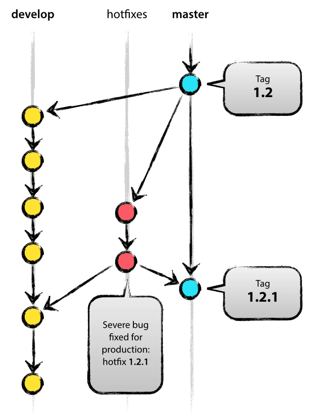

# Work Flow - Desenvolvimento

## Git Flow

Considerando que haverá várias pessoas trabalhando no mesmo projeto e que nós precisamos mantê-lo flexível e vivo, usaremos o modelo de trabalho proposto por [Vincent Driessen](https://nvie.com/about/) que, de acordo com o mesmo, foi a melhor metodologia em que ele chegou ao longo dos anos trabalhando com git: 


Primeiramente, a ideia é ter sempre uma branch central de dev para onde as novas features desenvolvidas serão mergeadas. A branch central é a nossa `origin`: 


_O fato de ter uma branch "central" não limita de forma alguma o nosso desenvolvimento: as branchs de cada nova feature podem conversar entre si também, caso seja necessário._

### `Branches` Principais:

Além disso, temos também temos duas "ramificações" principais que merecem nossa atenção: as branches`origin/develop` e `origin/master.`

A `origin/master`é a branch que contém sempre a versão que será liberada para produção, o que significa que é em quem todas as outras devem se basear e que as alterações só chegam até ela depois de terem passado pelas devidas revisões.

Já a `origin/develop` vai sempre refletir as alterações mais recentes realizada por nós. Quando uma das features desenvolvidas são mergeadas, é pra cá que elas vêm e é daqui que saem as alterações que vão para a master.


### `Branches`de Suporte:

Nós temos três branches que dão suporte à nossa `origin/develop`e que têm, cada uma, papéis muito específicos dentro do nosso projeto:

* release branches
* feature branches
* hotfix branches

**As release branches** oferecem suporte à preparação de uma nova versão de produção. Permitem pequenas correções de bugs e preparação de metadados para a release \(número da versão, datas de build, etc\). Feito esse processo, a develop está liberada para receber novas implementações.

> _They allow for last-minute dotting of i’s and crossing t’s._

```text
$ git checkout -b release-1.2 develop
Switched to a new branch "release-1.2"

$ ./bump-version.sh 1.2
Files modified successfully, version bumped to 1.2.

$ git commit -a -m "Bumped version number to 1.2"
[release-1.2 74d9424] Bumped version number to 1.2
1 files changed, 1 insertions(+), 1 deletions(-)
```

A nova branch criada deve existir por um tempo, até que a release seja lançada definitivamente. Enquanto isso, correções de bugs podem ser aplicadas aqui \(em vez de na `develop`branch\).

_Adicionar grandes novas funcionalidades em uma release branch é estritamente proibido. Elas devem ser mergeadas para a`develop`e aguardar o próximo grande lançamento._

**Concluindo uma release branch:**

```text
$ git checkout master
Switched to branch 'master'

$ git merge --no-ff release-1.2
Merge made by recursive.
(Summary of changes)

$ git tag -a 1.2
```

Com isso, a release está feita e taggeada para uma futura referência.

Para manter as alterações feitas na release branch, precisamos mergear elas novamente para a `develop`:

```text
$ git checkout develop
Switched to branch 'develop'

$ git merge --no-ff release-1.2
Merge made by recursive.
(Summary of changes)
```

Agora sim podemos deletar a nossa release branch:

```text
$ git branch -d release-1.2
Deleted branch release-1.2 (was ff452fe).
```

**As feature branches** são usadas para desenvolver novas funcionalidades para a próxima release ou para um futuro distante. A essência de uma feature branch é que ela existe **enquanto a feature** está em desenvolvimento, mas eventualmente será mergeado de volta na `develop`\(para adicionar definitivamente o novo recurso à próxima versão\) ou descartado.

_Feature branches geralmente existem apenas em repositórios de desenvolvedores, não na `origin`_

**Criando uma feature branch:**

```text
$ git checkout -b myfeature develop
Switched to a new branch "myfeature"
```

**Mergeando uma feature que acabou de ser desenvolvida:**

```text
$ git checkout develop
Switched to branch 'develop'

$ git merge --no-ff myfeature
Updating ea1b82a..05e9557
(Summary of changes)

$ git branch -d myfeature
Deleted branch myfeature (was 05e9557).

$ git push origin develop

```


**As hotfix branches** são muito parecidas com as release branches, pois também se destinam a preparar uma nova release de produção, só que não planejado. Elas surgem da necessidade de agir imediatamente sobre um estado indesejado de uma versão que já está em produção. Quando um bug crítico em uma versão de produção deve ser resolvido imediatamente, um branch de hotfix pode ser ramificado a partir da tag correspondente no branch master que marca a versão de produção.

_A essência é que o trabalho da equipe pode continuar, enquanto outra pessoa está preparando uma solução rápida de produção._



**Criando uma hotfix branch:**

```text
$ git checkout -b hotfix-1.2.1 master
Switched to a new branch "hotfix-1.2.1"

$ ./bump-version.sh 1.2.1
Files modified successfully, version bumped to 1.2.1.

$ git commit -a -m "Bumped version number to 1.2.1"
[hotfix-1.2.1 41e61bb] Bumped version number to 1.2.1
1 files changed, 1 insertions(+), 1 deletions(-)
```

```text
$ git commit -m "Fixed severe production problem"
[hotfix-1.2.1 abbe5d6] Fixed severe production problem
5 files changed, 32 insertions(+), 17 deletions(-)
```

**Concluindo uma hotfix branch:**

```text
$ git checkout master
Switched to branch 'master'

$ git merge --no-ff hotfix-1.2.1
Merge made by recursive.
(Summary of changes)

$ git tag -a 1.2.1
```

```text
$ git checkout develop
Switched to branch 'develop'

$ git merge --no-ff hotfix-1.2.1
Merge made by recursive.
(Summary of changes)
```

```text
$ git branch -d hotfix-1.2.1
Deleted branch hotfix-1.2.1 (was abbe5d6).
```

_Para utilizar comandos mais enxutos: [https://github.com/nvie/gitflow](https://github.com/nvie/gitflow)_

